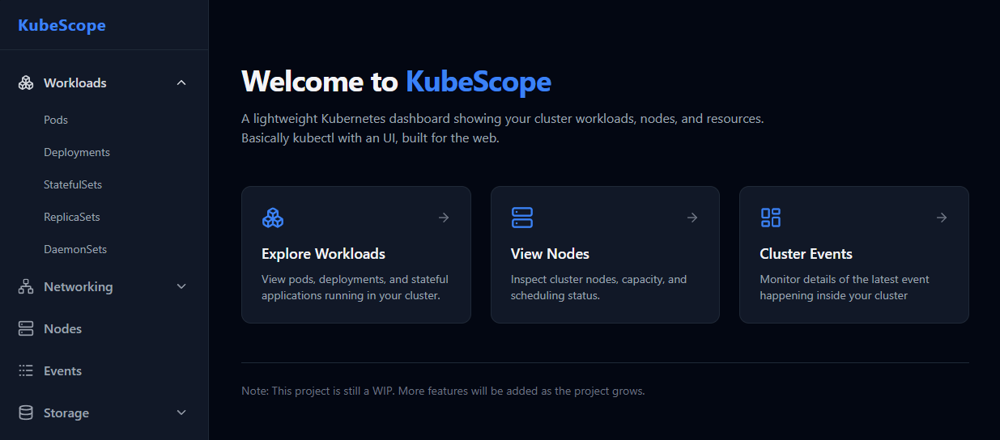

KubeScope Dashboard
====================

## Overview

Basically kubectl with an UI. Built with ReactJS and client-go. 

## Features

_This project is still a WIP, new features will be added regularly._

+ **Cluster Overview** – Nodes, namespaces, and workload status

+ **Workload Monitoring** – Deployments, Pods, ReplicaSets, and more

+ **Events** - Detailed event information inside the cluster

+ **User-Friendly Interface**: Intuitive UI for navigating and analyzing metrics.

## Prerequisites

Make sure you have the following installed:

+ Kubernetes cluster (v1.30+ recommended)

+ kubectl configured

+ Helm (optional)

## Installation & Setup

**Option 1: Using `kubectl`**

If you use kubectl, follow the instructions [here](./manifests).

**Option 2: Using Helm**

If you use Helm, install the chart [here](./charts/kubescope).

## Acknowledgements

+ The [Kubernetes](https://kubernetes.io) community

+ Kubernetes's [Go client package](https://github.com/kubernetes/client-go/tree/master)